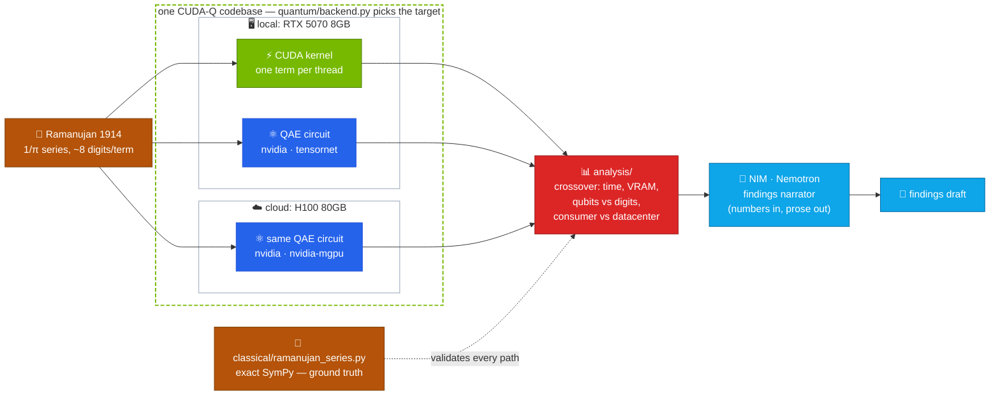

# q1729 — the quantum taxicab

<p align="center">
  <strong>How fast can a GPU compute π — as a classical machine, and as a quantum computer pretending to be one? From a consumer RTX to a datacenter H100 — with an AI layer that writes up what the numbers show.</strong>
</p>

> Ramanujan's mathematics meets the NVIDIA stack, end to end: CUDA C++, CUDA-Q/cuQuantum simulation, and NIM/Nemotron analysis — local silicon to cloud.

[](https://github.com/iarjunganesh/q1729/actions/workflows/ci.yml)
[](https://codecov.io/gh/iarjunganesh/q1729)
[](https://github.com/iarjunganesh/q1729/releases)
[](LICENSE)

[](https://nvidia.github.io/cuda-quantum/)
[](https://developer.nvidia.com/cuquantum-sdk)
[](https://build.nvidia.com/)
[](https://developer.nvidia.com/cuda-toolkit)

[](docs/adr/002-wsl2-runtime.md)
[](docs/adr/003-hybrid-cloud-nim.md)
[](docs/adr/002-wsl2-runtime.md)

[](https://www.python.org/)
[](https://www.sympy.org/)
[](https://docs.astral.sh/ruff/)

---

## Why q1729?

When G. H. Hardy visited Srinivasa Ramanujan, he remarked that his taxicab's number, **1729**, seemed rather dull. Ramanujan replied instantly: *"No, it is a very interesting number; it is the smallest number expressible as the sum of two cubes in two different ways"* — 1729 = 1³ + 12³ = 9³ + 10³. The `q` is for quantum. This repo carries that spirit: taking mathematics that looks ordinary from the outside and finding the structure inside it.

The mathematics is not decoration. Ramanujan's 1914 series delivers **~8 correct digits of π per term** — still among the fastest-converging classical algorithms known — and each term is independent, so it parallelizes perfectly across CUDA cores:

$$\frac{1}{\pi} = \frac{2\sqrt{2}}{9801} \sum_{k=0}^{\infty} \frac{(4k)!\,(1103 + 26390k)}{(k!)^4\, 396^{4k}}$$

And the thread doesn't stop at π: the same territory — modular forms, Ramanujan expander graphs — underpins modern **quantum LDPC error-correcting codes**, which is where this project is ultimately headed (stage 3).

## The central question

> **At what problem size does quantum simulation stop being competitive with a hand-written CUDA kernel — on the same silicon — and does datacenter silicon move the crossover, or just postpone it?**

Classical wins locally; that's not the finding. The finding is the *crossover analysis*: the measured shape of that loss on a consumer RTX 5070 (8GB, ~30-qubit ceiling) versus a cloud H100 (80GB, ~33 qubits on one card, ~34 needs a second GPU — see [docs/nvidia-access.md](docs/nvidia-access.md)), and what a real quantum device would need to beat either at its own game.

## Architecture — one codebase, consumer to datacenter



Two rules keep the hybrid honest (ADR 003):

1. **NIM/Nemotron is the analysis layer, never the simulator.** The narrator turns benchmark run files into findings drafts — every number comes from the run file, never from the model.
2. **Cloud is a second axis, not a replacement.** The same `quantum/backend.py` code selects `nvidia` on the RTX 5070 in WSL2, `qpp-cpu` in CI, and H100/multi-GPU targets on a rented cloud box — run files carry a `hardware` field so the curves land in one analysis.

## Roadmap

The three stages below are the research thread. The full evidence-sequenced plan — how each stage is *earned*, phase by phase, and everything from the original Blueprint — lives in **[docs/roadmap.md](docs/roadmap.md)** (Stage 1 = Phase 1, Stage 3 = Phase 2). This table is the summary; that document is authoritative for ordering.

| Stage | Focus | Deliverable |
| --- | --- | --- |
| **1 — π benchmark** | Ramanujan's 1914 1/π series as a hand-written CUDA kernel vs Quantum Amplitude Estimation with CUDA-Q, on the `nvidia` (cuStateVec) and `tensornet` (cuTensorNet) backends — run on both the RTX 5070 and a cloud H100 | Reproducible benchmark, consumer-vs-datacenter crossover analysis, NIM-drafted technical writeup |
| **2 — community** | Upstream contributions to CUDA-Q / CUDA-Q Academic; publish results; invite benchmark submissions from other GPUs (the run-file schema is hardware-agnostic) | Merged contributions, published writeup |
| **3 — Ramanujan graphs → qLDPC** | Ramanujan expander graphs underpin modern quantum LDPC codes. Simulate and decode them with CUDA-Q QEC (CUDA-QX) plus custom CUDA kernels | Open, reproducible QEC experiment lab |

## Stack

- **CUDA-Q** — core quantum programming platform (kernels, sampling, observables)
- **CUDA-QX** — extension libraries: Solvers (VQE/ADAPT) and QEC (codes + GPU decoders)
- **cuQuantum** — cuStateVec / cuTensorNet, the simulation engines behind CUDA-Q's backends
- **CUDA C++** — classical baseline kernels
- **NIM / Nemotron** — findings narrator via the NVIDIA NIM chat-completions API (`analysis/narrator.py`)
- **SymPy** — exact-rational reference implementation; any float drift in a GPU kernel shows up immediately

Runtime: CUDA-Q is Linux-only — on Windows, develop inside **WSL2** or the NGC container (`nvcr.io/nvidia/quantum/cuda-quantum`). ✅ **Verified on this machine**: cudaq 0.15 inside WSL2 initializes the `nvidia` (cuStateVec) target on the RTX 5070.

## Built to be trusted

- **Exact ground truth** — series terms are exact SymPy rationals, not floats; every GPU path is benchmarked against mathematics, not against another approximation
- **The AI layer can't invent results** — the narrator receives run-file numbers verbatim and only narrates; it is optional and degrades cleanly without a key (ADR 003)
- **Real-backend integration tests** — a Bell pair is actually simulated on the selected CUDA-Q target (CI: `qpp-cpu`; WSL2: `nvidia`), and the narrator is smoke-tested against the live NIM API when a key is present; unit tests mock only at the module boundary
- **Near-100% coverage** — measured 100%; CI gates at 95% (`.github/workflows/ci.yml`)
- **Decisions are written down** — `docs/adr/`: CUDA-Q over PennyLane/Qiskit (001), WSL2 runtime (002), hybrid cloud + NIM (003)

## Project structure

- `classical/ramanujan_series.py` — the 1914 series, exact SymPy (ground truth for the CUDA kernel)
- `quantum/backend.py` — CUDA-Q target selection (`nvidia` → `tensornet` → `qpp-cpu`) + environment diagnostic
- `analysis/narrator.py` — NIM/Nemotron findings narrator (`make narrate`)
- `data/sample_run.json` — synthetic sample run file demonstrating the benchmark schema
- `main.py` — status check; runs on any host, with or without cudaq / a NIM key
- `tests/` — `unit/` (any host) + `integration/` (real CUDA-Q simulation, live NIM; each skips where unavailable)
- `docs/adr/` — architecture decision records

## Quickstart

Any host (CPU-safe — classical math, narrator, unit tests, lint):

```powershell
py -3.14 -m venv .venv
.\.venv\Scripts\Activate.ps1
pip install -r requirements.txt
python main.py
pytest tests
```

NIM findings narrator (any host; key from [build.nvidia.com](https://build.nvidia.com)):

```bash
cp .env.example .env           # or: export NVIDIA_API_KEY=nvapi-...
make narrate                   # drafts findings from data/sample_run.json
```

CUDA-Q (WSL2 / Linux only):

```bash
pip install -r requirements-gpu.txt
python -m quantum.backend      # diagnostic: which target initialized
pytest tests                   # now includes the real-simulator integration tests
```

`make install` / `make test` / `make lint` / `make coverage` wrap the same commands (see `Makefile`).

## Hardware

| Axis | Component | Spec |
| --- | --- | --- |
| Local | GPU | NVIDIA RTX 5070 8GB (Blackwell), CUDA 13.x |
| Local | CPU / RAM / OS | AMD Ryzen 9, 32GB DDR5, Windows 11 + WSL2 |
| Cloud | GPU | NVIDIA H100 80GB (rented per-run for the datacenter axis) |
| Cloud | AI | NVIDIA NIM API — Nemotron (findings narrator) |

8GB VRAM caps statevector simulation at roughly 29–30 qubits at the `nvidia` target's default fp32 precision; a single 80GB H100 moves that to ~33, and reaching ~34 needs a second GPU (`nvidia-mgpu`, see [docs/nvidia-access.md](docs/nvidia-access.md)). The gap between those ceilings — and what it does to the crossover — is itself one of the research questions.

## Contributing

Stage 2 opens this up properly. Until then: issues and benchmark-idea discussions welcome — see [CONTRIBUTING.md](CONTRIBUTING.md).

## License

[MIT](LICENSE)

---

*Author: Arjun Ganesh — [github.com/iarjunganesh](https://github.com/iarjunganesh)*
