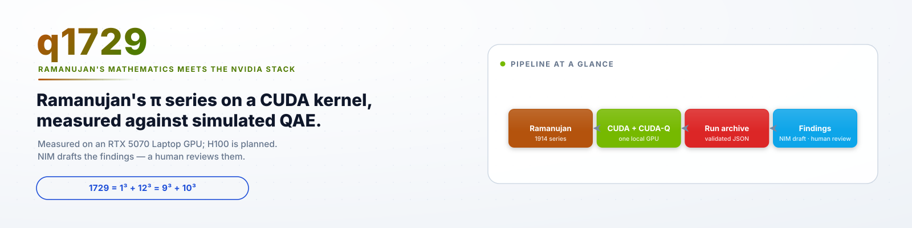
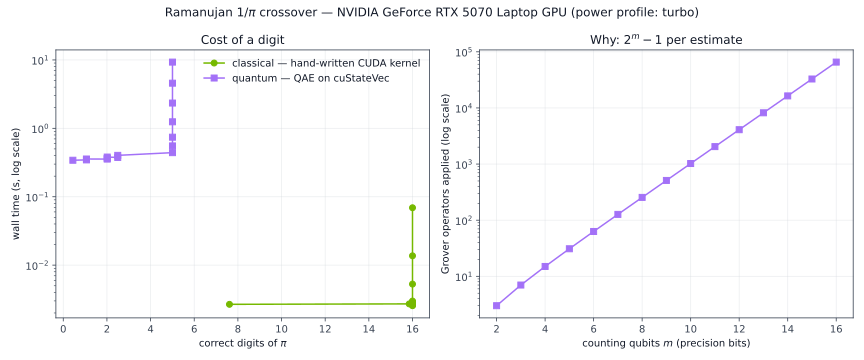

# q1729 — the quantum taxicab

<p align="center">
  <picture>
    <source media="(prefers-color-scheme: dark)" srcset="assets/brand/q1729-banner-dark.svg">
    <source media="(prefers-color-scheme: light)" srcset="assets/brand/q1729-banner-light.svg">
    
  </picture>
</p>

> Ramanujan's mathematics meets the NVIDIA stack: a hand-written CUDA C++ kernel and CUDA-Q/cuQuantum quantum simulation, measured against each other on the same silicon, with NIM/Nemotron writing up what the numbers show.

[](https://github.com/iarjunganesh/q1729/actions/workflows/ci.yml)
[](https://codecov.io/gh/iarjunganesh/q1729)
[](https://github.com/iarjunganesh/q1729/releases)
[](LICENSE)

<!-- Row 2 — the NVIDIA stack, in the order the Stack section names it.
     Every badge links to that library's official documentation site. -->
[](https://docs.nvidia.com/cuda/cuda-c-programming-guide/)
[](https://nvidia.github.io/cuda-quantum/latest/index.html)
[](https://nvidia.github.io/cudaqx/)
[](https://docs.nvidia.com/cuda/cuquantum/latest/)
[](https://docs.nvidia.com/nim/)

<!-- Row 3 — the Python stack: language, libraries, and the CI-enforced gates.
     Every badge links to that project's official documentation site. -->
[](https://docs.python.org/3/)
[](https://docs.sympy.org/latest/index.html)
[](https://numpy.org/doc/stable/)
[](https://docs.cupy.dev/en/stable/)
[](https://docs.astral.sh/ruff/)
[](https://mypy.readthedocs.io/en/stable/)
[](https://docs.pytest.org/en/stable/)

<!-- Row 4 — the two hardware axes this project measures -->
[](https://www.nvidia.com/en-us/geforce/graphics-cards/50-series/rtx-5070-family/)
[](https://www.nvidia.com/en-us/data-center/h100/)
[](docs/adr/002-wsl2-runtime.md)

---

## Why q1729?

When G. H. Hardy visited Srinivasa Ramanujan, he remarked that his taxicab's number, **1729**, seemed rather dull. Ramanujan replied instantly: *"No, it is a very interesting number; it is the smallest number expressible as the sum of two cubes in two different ways"* — 1729 = 1³ + 12³ = 9³ + 10³. The `q` is for quantum. This repo carries that spirit: taking mathematics that looks ordinary from the outside and finding the structure inside it.

The mathematics is not decoration. Ramanujan's 1914 series delivers **~8 correct digits of π per term** — still among the fastest-converging classical algorithms known — and each term is independent, so it parallelizes perfectly across CUDA cores:

$$\frac{1}{\pi} = \frac{2\sqrt{2}}{9801} \sum_{k=0}^{\infty} \frac{(4k)!\,(1103 + 26390k)}{(k!)^4\, 396^{4k}}$$

And the thread doesn't stop at π: the same territory — modular forms, Ramanujan expander graphs — underpins modern **quantum LDPC error-correcting codes**, which is where this project is ultimately headed (stage 3).

## The central question

> **At what problem size does quantum simulation stop being competitive with a hand-written CUDA kernel — on the same silicon — and does datacenter silicon move the crossover, or just postpone it?**

Classical wins locally; that was never in doubt. The finding is the *shape* of that loss, measured rather than asserted — and the two mechanisms behind it, which turned out to be more interesting than the gap itself.

## The first real result

Measured on an RTX 5070 Laptop GPU on **2026-08-05** — the full run file, including every raw timing sample, is [`benchmarks/runs/2026-08-05-rtx5070-turbo.json`](benchmarks/runs/2026-08-05-rtx5070-turbo.json).

<p align="center">
  <a href="benchmarks/plots/crossover-light.svg" target="_blank" rel="noopener noreferrer">
    <picture>
      <source media="(prefers-color-scheme: dark)" srcset="benchmarks/plots/crossover-dark.svg">
      <source media="(prefers-color-scheme: light)" srcset="benchmarks/plots/crossover-light.svg">
      
    </picture>
  </a>
</p>

| | Classical — hand-written CUDA kernel | Quantum — QAE on cuStateVec |
| --- | --- | --- |
| Best accuracy reached | **16 digits** (double-precision ceiling) | **5.0 digits** |
| Time to get there | **2.6 ms** (2 series terms) | **0.44 s** (m = 10) |
| Cost of one more digit | flat until ~1024 terms | ×2 per precision bit |
| Peak GPU utilization | **95%** | **12–20%** |

Three things the data says that prose alone would not have:

1. **No crossover exists on this silicon** — the classical kernel is ~170× faster while delivering three times the digits. That is the expected result, and now it is a measured one.
2. **The quantum arm never saturates the GPU.** At 12–20% utilization it is bound by per-gate dispatch, not statevector arithmetic. Faster silicon would barely move these numbers; *wider circuits* would. That reframes the H100 question — the datacenter axis is about qubit ceiling, not speed.
3. **Accuracy plateaus at m = 10 while cost keeps doubling.** Not a bug: the eigenphase 0.34668271 lies within 3.0 × 10⁻⁶ of the 10-bit dyadic 355/1024, so further counting qubits correctly return zeros. Every run row carries `phase_error` and `phase_resolution` so a reader can verify this rather than take it on faith.

The narrator's draft of these findings — numbers in, prose out, nothing invented (ADR 003) — is [`…-findings.md`](benchmarks/runs/2026-08-05-rtx5070-turbo-findings.md).

## Architecture — one codebase, consumer to datacenter

<p align="center">
  <a href="assets/architecture/pipeline-light.svg" target="_blank" rel="noopener noreferrer">
    <picture>
      <source media="(prefers-color-scheme: dark)" srcset="assets/architecture/pipeline-dark.svg">
      <source media="(prefers-color-scheme: light)" srcset="assets/architecture/pipeline-light.svg">
      
    </picture>
  </a>
</p>

<p align="center"><sub>Source: <a href="assets/architecture/pipeline.mmd">Mermaid</a> · renders: <a href="assets/architecture/pipeline-light.svg">light SVG</a> / <a href="assets/architecture/pipeline-dark.svg">dark SVG</a></sub></p>

Two rules keep the hybrid honest (ADR 003):

1. **NIM/Nemotron is the analysis layer, never the simulator.** The narrator turns benchmark run files into findings drafts — every number comes from the run file, never from the model.
2. **Cloud is a second axis, not a replacement.** The same `quantum/backend.py` code selects `nvidia` on the RTX 5070 in WSL2, `qpp-cpu` in CI, and H100/multi-GPU targets on a rented cloud box — run files carry a `hardware_id` field and an environment block so curves from different machines land in one analysis.

## Roadmap

The three stages below are the research thread. The full evidence-sequenced plan — how each stage is *earned*, phase by phase — lives in **[docs/roadmap.md](docs/roadmap.md)** (Stage 1 = Phase 1, Stage 3 = Phase 2). This table is the summary; that document is authoritative for ordering.

| Stage | Focus | Status |
| --- | --- | --- |
| **1 — π benchmark** | Ramanujan's 1914 1/π series as a hand-written CUDA kernel vs Quantum Amplitude Estimation with CUDA-Q, on the `nvidia` (cuStateVec) backend | ✅ **RTX 5070 crossover measured** — kernel, QAE circuit, harness, run file, plot, and narrated writeup all in the repo. Remaining: the optional cloud-H100 axis |
| **2 — community** | Upstream contributions to CUDA-Q / CUDA-Q Academic; publish results; invite benchmark submissions from other GPUs (the run-file schema is hardware-agnostic) | Next |
| **3 — Ramanujan graphs → qLDPC** | Ramanujan expander graphs underpin modern quantum LDPC codes. Simulate and decode them with CUDA-Q QEC (CUDA-QX) plus custom CUDA kernels | Planned |

## Stack

- **CUDA C++** — the classical baseline kernel (`classical/ramanujan_kernel.cu`), one series term per thread with a shared-memory tree reduction, compiled at runtime through NVRTC ([ADR 005](docs/adr/005-cuda-kernel-via-nvrtc.md))
- **CUDA-Q** — core quantum programming platform (kernels, sampling, target selection)
- **CUDA-QX** — extension libraries: Solvers (VQE/ADAPT) and QEC (codes + GPU decoders) *(stage 3)*
- **cuQuantum** — cuStateVec / cuTensorNet, the simulation engines behind CUDA-Q's backends
- **NIM / Nemotron** — findings narrator via the NVIDIA NIM chat-completions API (`analysis/narrator.py`)
- **SymPy** — exact-rational reference implementation; any float drift in the GPU kernel shows up immediately

Runtime: CUDA-Q is Linux-only — on Windows, develop inside **WSL2** or the NGC container (`nvcr.io/nvidia/quantum/cuda-quantum`).

✅ **Verified on this machine, 2026-08-05**: cudaq 0.15.1 in WSL2 selects the `nvidia` (cuStateVec) target on the RTX 5070 Laptop GPU; the CUDA kernel compiles through NVRTC 13.3.33 and matches the exact SymPy partial sums to 1e-15 relative; 156 tests pass at 100% coverage.

## Built to be trusted

- **Exact ground truth** — series terms are exact SymPy rationals, not floats; the CUDA kernel is asserted against them term by term, so a bad reduction or a precision regression fails a test rather than quietly shifting a result
- **Reproducible by construction** — the kernel sums block partials on the host instead of using `atomicAdd`, so identical inputs give bit-identical output; run files carry the machine, the software versions, the declared power profile, and every raw timing sample
- **Nothing plots itself into a result** — `data/sample_run.json` is labeled synthetic and `benchmarks/plot.py` refuses to plot it
- **The AI layer can't invent results** — the narrator receives run-file numbers verbatim and only narrates; it is optional and degrades cleanly without a key (ADR 003)
- **Real-backend integration tests** — the CUDA kernel and the QAE circuit are exercised on real hardware/simulators, not only mocks; unit tests mock at the module boundary
- **100% coverage, no buffer** — measured 100% on WSL2/CI across 156 tests; CI gates at 100% with zero threshold ([ADR 004](docs/adr/004-repo-hygiene-and-agent-sync.md))
- **A written standard of evidence** — [`docs/handbook/`](docs/handbook/) states the principles and the nine-field contract every experiment must satisfy before it runs
- **Decisions are written down** — `docs/adr/`: CUDA-Q over PennyLane/Qiskit (001), WSL2 runtime (002), hybrid cloud + NIM (003), repo hygiene (004), NVRTC over an nvcc build step (005)

## Project structure

- `classical/ramanujan_kernel.cu` — the hand-written CUDA C++ kernel: one series term per thread, shared-memory tree reduction
- `classical/cuda_kernel.py` — compiles, launches and times the kernel; degrades cleanly on hosts without a GPU
- `classical/ramanujan_series.py` — the 1914 series, exact SymPy (ground truth for the kernel)
- `quantum/qae.py` — canonical Quantum Amplitude Estimation of π/4, with the resource-cost caveats stated in the module
- `quantum/backend.py` — CUDA-Q target selection (`nvidia-mgpu` → `nvidia` → `tensornet` → `qpp-cpu`) + environment diagnostic
- `benchmarks/harness.py` — runs both arms and emits a contract-conforming run file
- `benchmarks/environment.py` — captures hardware, versions, and GPU load during a run
- `benchmarks/plot.py` — theme-aware crossover plots; refuses synthetic input
- `benchmarks/runs/`, `benchmarks/plots/` — measured run files, narrated writeups, and figures
- `analysis/narrator.py` — NIM/Nemotron findings narrator (`make narrate`)
- `data/sample_run.json` — synthetic sample run file demonstrating the schema; never a measurement
- `main.py` — status check; runs on any host, with or without cudaq / cupy / a NIM key
- `tests/` — `unit/` (any host) + `integration/` (real CUDA kernel, real CUDA-Q simulation, live NIM; each skips where unavailable)
- `docs/handbook/` — principles and research standards (roadmap Phase 0)
- `docs/adr/` — architecture decision records
- `docs/sessions.md` — dated log of what each work session changed and verified
- `assets/architecture/`, `assets/brand/` — theme-aware diagram and banner sources (edit the `.mmd`/`.py`, never the SVG)
- `AGENTS.md` — cross-tool discipline for keeping this README, `CLAUDE.md`, and every status-bearing doc in sync before commits and tags

## Quickstart

Any host (CPU-safe — classical math, narrator, unit tests, lint):

```powershell
py -3.14 -m venv .venv
.\.venv\Scripts\Activate.ps1
pip install -r requirements.txt
python main.py
pytest tests
```

NIM findings narrator (any host; key from [build.nvidia.com](https://build.nvidia.com)):

```bash
cp .env.example .env           # or: export NVIDIA_API_KEY=nvapi-...
make narrate                   # drafts findings from data/sample_run.json
```

GPU work — the CUDA kernel and CUDA-Q (WSL2 / Linux only):

```bash
pip install -r requirements-gpu.txt
python -m quantum.backend       # diagnostic: which CUDA-Q target initialized
python -m classical.cuda_kernel  # diagnostic: which GPU the kernel will use
pytest tests                     # now includes the real-hardware integration tests
```

Reproduce the benchmark (declare your power profile — it is a recorded control):

```bash
make benchmark POWER_PROFILE=turbo    # writes benchmarks/runs/<date>-<host>.json
make plot RUN=benchmarks/runs/<file>.json
```

`make install` / `make test` / `make lint` / `make coverage` wrap the same commands (see `Makefile`).

## Hardware

| Axis | Component | Spec |
| --- | --- | --- |
| Local | GPU | NVIDIA GeForce RTX 5070 Laptop GPU, 8151 MiB (Blackwell, SM 12.0), CUDA 13.3, driver 610.88 (verified 2026-08-05) |
| Local | CPU / RAM / OS | AMD Ryzen 9, 32GB DDR5, Windows 11 + WSL2 |
| Cloud | GPU | NVIDIA H100 80GB — planned datacenter axis (rented per-run); no H100 run has been executed yet |
| Cloud | AI | NVIDIA NIM API — Nemotron (findings narrator) |

8GB VRAM caps statevector simulation at roughly 29–30 qubits at the `nvidia` target's default fp32 precision; a single 80GB H100 moves that to ~33, and reaching ~34 needs a second GPU (`nvidia-mgpu`, see [docs/nvidia-access.md](docs/nvidia-access.md)). The stage-1 circuits are far below that ceiling — which is itself the finding in point 2 above: on this workload the constraint is dispatch, not memory.

## Contributing

Stage 2 opens this up properly. Until then: issues and benchmark-idea discussions welcome — see [CONTRIBUTING.md](CONTRIBUTING.md).

## License

[MIT](LICENSE)

---

*Author: Arjun Ganesh — [github.com/iarjunganesh](https://github.com/iarjunganesh)*
