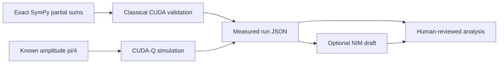

# q1729 — the quantum taxicab

<p align="center">
  <picture>
    <source media="(prefers-color-scheme: dark)" srcset="assets/brand/q1729-banner-dark.svg">
    <source media="(prefers-color-scheme: light)" srcset="assets/brand/q1729-banner-light.svg">
    
  </picture>
</p>

> Ramanujan's mathematics meets the NVIDIA stack: a hand-written CUDA C++ kernel and CUDA-Q/cuQuantum quantum simulation, measured against each other on the same silicon, with NIM/Nemotron writing up what the numbers show.

[](https://github.com/iarjunganesh/q1729/actions/workflows/ci.yml)
[](https://codecov.io/gh/iarjunganesh/q1729)
[](https://github.com/iarjunganesh/q1729/releases)
[](LICENSE)

<!-- Row 2 — the NVIDIA stack, in the order the Stack section names it.
     Every badge links to that library's official documentation site. -->
[](https://docs.nvidia.com/cuda/cuda-c-programming-guide/)
[](https://nvidia.github.io/cuda-quantum/latest/index.html)
[](https://nvidia.github.io/cudaqx/)
[](https://docs.nvidia.com/cuda/cuquantum/latest/)
[](https://docs.nvidia.com/nim/)

<!-- Row 3 — the Python stack: language, libraries, and the CI-enforced gates.
     Every badge links to that project's official documentation site. -->
[](https://docs.python.org/3/)
[](https://docs.sympy.org/latest/index.html)
[](https://numpy.org/doc/stable/)
[](https://docs.cupy.dev/en/stable/)
[](https://docs.astral.sh/ruff/)
[](https://mypy.readthedocs.io/en/stable/)
[](https://docs.pytest.org/en/stable/)

<!-- Row 4 — the two hardware axes this project measures -->
[](https://www.nvidia.com/en-us/geforce/graphics-cards/50-series/rtx-5070-family/)
[](https://www.nvidia.com/en-us/data-center/h100/)
[](docs/adr/002-wsl2-runtime.md)

Version badges describe repository dependency floors or the archived stack,
not a freshly resolved GPU environment. CUDA-QX is a planned extension.

---

## Why q1729?

When G. H. Hardy visited Srinivasa Ramanujan, he remarked that his taxicab's number, **1729**, seemed rather dull. Ramanujan replied instantly: *"No, it is a very interesting number; it is the smallest number expressible as the sum of two cubes in two different ways"* — 1729 = 1³ + 12³ = 9³ + 10³. The `q` is for quantum. This repo carries that spirit: taking mathematics that looks ordinary from the outside and finding the structure inside it.

The mathematics is not decoration. Ramanujan's 1914 series delivers **~8 correct digits of π per term** in exact arithmetic. Independent terms permit parallel evaluation, but unequal term costs, launch overhead and fp64 saturation limit useful GPU scaling:

$$\frac{1}{\pi} = \frac{2\sqrt{2}}{9801} \sum_{k=0}^{\infty} \frac{(4k)!\,(1103 + 26390k)}{(k!)^4\, 396^{4k}}$$

And the thread doesn't stop at π: the same territory — modular forms, Ramanujan expander graphs — underpins modern **quantum LDPC error-correcting codes**, which is where this project is ultimately headed (stage 3).

## The current experiment

How do a CUDA implementation of Ramanujan's series and a simulated canonical
QAE circuit behave under a declared local timing/accuracy sweep? QAE encodes
the already-known amplitude `math.pi / 4`; this is a simulator case study,
not an independent π algorithm or a quantum-advantage experiment.

## The first real result

The [2026-08-05 archive](benchmarks/runs/2026-08-05-rtx5070-turbo.json)
contains 27 configurations, five timing repeats each and 4000 shots per QAE
estimate, recorded on an RTX 5070 Laptop GPU in turbo mode.

| Selected row | Mean wall time | Reported accuracy |
| --- | --- | --- |
| Classical, 2 terms | 2.714 ms | 15.85 relative-error digits against `math.pi` |
| QAE, 10 counting qubits | 0.441 s | 5.00 relative-error digits against `math.pi` |

No crossover was observed within this sweep. These two selected rows differ
by about 162.5× in wall time and have different accuracy; this is not a
matched-accuracy speedup or a universal claim about the hardware.
The observed QAE plateau is consistent with dyadic phase quantization.
Sampled GPU utilization alone does not establish a dispatch bottleneck or
predict H100 performance. Wrapper work is included in the recorded timings.

Read the [reviewed findings](benchmarks/runs/2026-08-05-rtx5070-turbo-reviewed.md)
for row-level qualifications. The original narrated draft and measured JSON
are preserved; the draft's stronger claims are superseded by that review.

## Architecture and direction


```mermaid
flowchart LR
    S[Exact SymPy partial sums] --> C[Classical CUDA validation]
    A[Known amplitude pi/4] --> Q[CUDA-Q simulation]
    C --> R[Measured run JSON]
    Q --> R
    R --> H[Human-reviewed analysis]
    R --> N[Optional NIM draft]
    N --> H
```

The series and QAE arms are distinct computations. NIM receives JSON and
drafts prose; the current code does not verify its statements. It never
supplies numerical simulation results. Cloud H100 and multi-GPU execution
remain unmeasured extensions. The [legacy diagram](assets/architecture/README.md)
is a conceptual illustration with limitations documented beside its source.

## Roadmap

The three stages below are the research thread. The full evidence-sequenced plan — how each stage is *earned*, phase by phase — lives in **[docs/roadmap.md](docs/roadmap.md)** (Stage 1 = Phase 1, Stage 3 = Phase 2). This table is the summary; that document is authoritative for ordering.

| Stage | Focus | Status |
| --- | --- | --- |
| **1 — π benchmark** | Ramanujan's 1914 1/π series as a hand-written CUDA kernel vs Quantum Amplitude Estimation with CUDA-Q, on the `nvidia` (cuStateVec) backend | **RTX archive delivered; evidence/reproducibility repairs open.** Optional H100 unmeasured |
| **2 — community** | Upstream contributions to CUDA-Q / CUDA-Q Academic; publish results; invite benchmark submissions from other GPUs (the run-file schema is hardware-agnostic) | Ongoing workstream; publication depends on contribution/evidence gates |
| **3 — Ramanujan graphs → qLDPC** | Ramanujan expander graphs underpin modern quantum LDPC codes. Simulate and decode them with CUDA-Q QEC (CUDA-QX) plus custom CUDA kernels | Started: graph construction only; classical decoder and feasible qLDPC study next |

## Stack

- **CUDA C++** — the classical baseline kernel (`classical/ramanujan_kernel.cu`), one series term per thread with a shared-memory tree reduction, compiled at runtime through NVRTC ([ADR 005](docs/adr/005-cuda-kernel-via-nvrtc.md))
- **CUDA-Q** — core quantum programming platform (kernels, sampling, target selection)
- **CUDA-QX** — extension libraries: Solvers (VQE/ADAPT) and QEC (codes + GPU decoders) *(stage 3)*
- **cuQuantum** — cuStateVec / cuTensorNet, the simulation engines behind CUDA-Q's backends
- **NIM / Nemotron** — findings narrator via the NVIDIA NIM chat-completions API (`analysis/narrator.py`)
- **SymPy** — exact-rational reference implementation; any float drift in the GPU kernel shows up immediately

Runtime: this repository uses **WSL2/Linux** for the CUDA-Q and CUDA path.
The 2026-08-05 WSL2 GPU verification is historical. The 2026-09-06 audit
could not repeat it because WSL2 could not attach its virtual disk.

## Built to be trusted

- Exact SymPy partial sums provide a reference for the CUDA integration test
  at 1e-15 relative tolerance. Host reduction avoids atomic accumulation order;
  this does not guarantee bitwise identity across hardware/toolchains.
- Synthetic sample data is labeled and rejected by the plotter.
- CI requires 100% coverage. Windows audit: 316 passed, 29 skipped, 99.73%
  with no NIM key. CUDA-Q CPU integration runs in CI; GPU integration requires
  a GPU. Historical WSL2 counts are not current CI counts.
- The [research contract](docs/handbook/research-standards.md) is a requirement;
  semantic validation, archive protection, schema-4 traceability and a committed
  measurement protocol are implemented;
  fresh GPU verification and profiling remain open
  [Phase 1 repair gates](docs/roadmap.md#phase-1--the-first-real-result).
- [ADRs](docs/adr/README.md) record decisions, including ROCm as a conditional
  Phase 4 backend and the evidence-first sequence in ADR 007.

## Project structure

- `classical/ramanujan_kernel.cu` — the hand-written CUDA C++ kernel: one series term per thread, shared-memory tree reduction
- `classical/cuda_kernel.py` — compiles, launches and times the kernel; degrades cleanly on hosts without a GPU
- `classical/ramanujan_series.py` — the 1914 series, exact SymPy (ground truth for the kernel)
- `classical/ramanujan_graph.py` — LPS Ramanujan expander graphs, spectrally verified against the `2√(k−1)` bound (ground truth for the Stage 3 / Phase 2 qLDPC experiment; CPU-only, never timed)
- `quantum/qae.py` — canonical Quantum Amplitude Estimation of π/4, with the resource-cost caveats stated in the module
- `quantum/backend.py` — CUDA-Q target selection (`nvidia-mgpu` → `nvidia` → `tensornet` → `qpp-cpu`) + environment diagnostic
- `benchmarks/harness.py` — runs both arms and emits schema-4 run JSON with semantic validation and exclusive output creation
- `benchmarks/protocol.py` — the measurement protocol, committed before data and hashed into every run file
- `quantum/quantization.py` — closed-form QAE reference (error floor, plateau, outcome distribution); CPU-only
- `benchmarks/environment.py` — captures hardware, versions, and GPU load during a run
- `benchmarks/plot.py` — theme-aware crossover plots; refuses synthetic input
- `benchmarks/runs/`, `benchmarks/plots/` — measured run files, narrated writeups, and figures
- `analysis/narrator.py` — NIM/Nemotron findings narrator (`make narrate`)
- `data/sample_run.json` — synthetic sample run file demonstrating the schema; never a measurement
- `main.py` — status check; runs on any host, with or without cudaq / cupy / a NIM key
- `tests/` — `unit/` (any host) + `integration/` (real CUDA kernel, real CUDA-Q simulation, live NIM; each skips where unavailable)
- `docs/handbook/` — principles and research standards (roadmap Phase 0)
- `docs/adr/` — architecture decision records
- `docs/sessions.md` — dated log of what each work session changed and verified
- `assets/architecture/`, `assets/brand/` — theme-aware diagram and banner sources (edit the `.mmd`/`.py`, never the SVG)
- `AGENTS.md` — cross-tool discipline for keeping this README, `CLAUDE.md`, and every status-bearing doc in sync before commits and tags

## Quickstart

Any host (CPU-safe — classical math, narrator, unit tests, lint):

```powershell
py -3.14 -m venv .venv
.\.venv\Scripts\Activate.ps1
pip install -r requirements.txt
python main.py
pytest tests
```

NIM findings narrator (any host; key from [build.nvidia.com](https://build.nvidia.com)):

```bash
# Export NVIDIA_API_KEY in this shell; .env is not loaded automatically.
# Obtain/set the key privately; do not commit or print it.
make narrate                   # drafts findings from data/sample_run.json
```

GPU work — the CUDA kernel and CUDA-Q (WSL2 / Linux only):

```bash
pip install -r requirements.txt
pip install -r requirements-gpu.txt
python -m quantum.backend       # diagnostic: which CUDA-Q target initialized
python -m classical.cuda_kernel  # diagnostic: which GPU the kernel will use
pytest tests                     # now includes the real-hardware integration tests
```

Reproduction instructions are in [benchmarks/README.md](benchmarks/README.md).
`make benchmark` now uses a unique date-plus-UUID filename; the writer refuses
existing paths. Plot defaults are run-specific and both themes are protected.
The default 2000 shots still differs from the archive's 4000; use an explicit
shot count when reproducing it. [Schema validation](docs/run-file.md) accepts
legacy archives unchanged. Schema 3 retains every timed outcome, count distribution,
source manifest, selected device and target/precision; see [run-file details](docs/run-file.md).
New findings require [human review records](docs/findings-review.md).

`make install` / `make test` / `make lint` / `make coverage` wrap the commands
in the [Makefile](Makefile). Use separate Windows and Linux virtual environments;
see [setup](docs/setup.md).

## Hardware

| Axis | Evidence |
| --- | --- |
| Local archive | RTX 5070 Laptop GPU, 8151 MiB; recorded driver 610.88 on 2026-08-05 |
| Current Windows audit | Same GPU model; driver 616.56 reported by `nvidia-smi` on 2026-09-06; WSL2/CUDA runtime not reverified |
| H100 / multi-GPU | Planned only; no measured archive |
| NIM | Optional external narrator; no live call in this audit |

Statevector storage grows as bytes-per-amplitude × 2^qubits. Bare fp32 storage
is 4 GiB at 29 qubits and 8 GiB at 30, before simulator workspace and other
allocations. This is a storage estimate, not a measured usable qubit ceiling.
The archive's largest circuit has only 19 total qubits (4 MiB bare fp32 state).

## Contributing

Stage 2 opens this up properly. Until then: issues and benchmark-idea discussions welcome — see [CONTRIBUTING.md](CONTRIBUTING.md).

## License

[MIT](LICENSE)

---

*Author: Arjun Ganesh — [github.com/iarjunganesh](https://github.com/iarjunganesh)*
