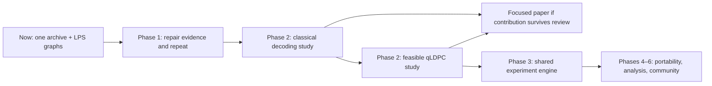

# Q1729 — Vision & Roadmap

q1729 aims to become a reproducible computational research platform built around
Ramanujan mathematics, accelerated classical computation and quantum simulation.
Today it has one archived GPU experiment and an initial graph construction.
The platform is the destination, earned through validated experiments and reuse.

The [README](../README.md) defines the three-stage research thread: π;
community/publication; Ramanujan graphs → qLDPC. This document defines execution
order: Stage 1 maps to Phase 1, Stage 3 to Phase 2, and Stage 2 is a continuing
workstream. [PATHWAYS](PATHWAYS.md) explains the direction without introducing
another plan. [ADR 007](adr/007-evidence-first-phase-gates.md) records this revision.

## Where the repo actually is (v0.2.0)

Audit date: **2026-09-06**, release baseline `f88a926`; graph/audit checkpoint `e8b2060`. The graph module
and tests were committed in `e8b2060` beyond that release; released CI does not verify them.

- Phase 0 standards are adopted, but enforcement is incomplete. JSON key
  presence alone did not validate the contract; P1-R1 now supplies semantic validation.
  P1-R2 now captures source/device metadata and per-repeat outcomes; fresh GPU verification remains pending.
- Phase 1 delivered a CUDA kernel, known-amplitude QAE circuit, harness, figures
  and the 2026-08-05 RTX 5070 Laptop GPU archive. Interpretation and
  reproducibility repair gates are open. There is no H100 result.
- QAE encodes the already-known amplitude `math.pi / 4`. This is a simulator
  case study, not an independent π algorithm or quantum-advantage result.
  No crossing was observed within the tested sweep.
- Phase 2 has exact modular LPS graph construction and floating-point spectral
  checks, not an exact spectral proof. No parity-check implementation, decoder,
  qLDPC experiment or second measured run exists.
- The Windows audit recorded 316 passed, 29 skipped with the NIM key removed,
  and 99.73% coverage. The rebuilt WSL2 host records 344 passed, 1 skipped and
  100.00% on 2026-09-06. Earlier WSL2 results were 186 passed / 100%; they
  were not reproduced because WSL2 could not attach its virtual disk. CI CPU
  simulation and GPU integration evidence must be distinguished.
- NIM drafts unchecked prose from JSON. Its output needs human review; raw
  measured JSON is never corrected by rewriting its numbers.

See the [Markdown audit](markdown-audit-2026-09-06.md) for the complete file
inventory and the distinction between documentation corrections and open code work.

## Sequence at a glance

| Phase | Deliverable | Status |
| --- | --- | --- |
| 0 — constitution | Evidence standards and decision records | Adopted; enforcement gaps remain |
| 1 — first real result | Reproducible, correctly scoped π case study | Archive delivered; repair/repeat gates open |
| 2 — second experiment | Classical decoding controls, then feasible qLDPC | Graph construction only |
| 3 — shared engine | Reuse extracted from two validated experiments | Deferred until repeated needs exist |
| 4 — backend independence | Controlled portability study; ROCm per ADR 006 | Conditional; no verified port or AMD run |
| 5 — longitudinal analysis | Reusable cross-run analysis tools | Deferred tooling; statistics required now |
| 6 — research community | Independent reproduction and maintenance | Participation welcome; platform maturity unearned |

Every gate closes with linked evidence, not a date or an implementation checkbox.
Independent design work can overlap; later phases cannot waive earlier gates.

## Phase 0 — Constitution (lightweight)

Keep the [principles](handbook/principles.md) and
[research standards](handbook/research-standards.md) as requirements. Distinguish
a rule, its implementation and evidence that it was exercised. Preserve session
history and ADR bodies; add dated amendments. Commit prospective protocols
before new runs. A hypothesis constant first committed with its result does not
prove preregistration; the existing archive remains useful exploratory evidence.

## Phase 1 — The first real result

**Immediate milestone: repair the evidence path and produce one bounded repeat.**
Preserve the old archive and read its
[reviewed interpretation](../benchmarks/runs/2026-08-05-rtx5070-turbo-reviewed.md).

### P1-R1 — Protect and validate evidence

- [x] Refuse to overwrite measured JSON; preserve figures under run-specific paths.
- [x] Introduce versioned semantic validation: nonempty required values, types,
  finite numbers, repeat counts, backend identity and measured/synthetic status.
- [x] Apply validation at writer, plotter, narrator and CI boundaries, with
  explicit legacy handling and meaningful malformed-input/overwrite tests.

**Exit:** conflicting outputs and invalid records are rejected without altering
archives; valid old data stays readable under its legacy schema.

**Implementation verified on CPU, 2026-09-06:** shared validation and exclusive
outputs pass boundary tests; new validator/archive modules have 100% statement
coverage. Schema and legacy behavior are in [run-file.md](run-file.md) and ADR 008.
Fresh Linux/CI full-gate verification remains unavailable; WSL2 cannot attach
its disk. Do not treat local completion as release readiness.

### P1-R2 — Make each claim traceable

- [x] Capture source revision/dirty state, resolved dependencies, selected device,
  actual simulator target/precision and complete experiment configuration.
- [x] Retain each repeat's outcome, timing and QAE counts; record supported seeds
  and any backend nondeterminism. Schema 3 retains every timed outcome.
- [x] Derive plot/control labels from actual backend metadata, including CPU fallback.
- [x] Require review of every numerical and causal statement in NIM findings.
- [x] Resolve non-kernel coverage exclusions; make release checks verify quality
  results, version/changelog agreement and main ancestry.

**Exit:** every plotted point is traceable to samples, configuration and source.
The 100% CI coverage gate stays unchanged. Release automation already exists;
it now depends on preflight checks and a fresh reusable CI run for the tag.

**Implementation verified on CPU, 2026-09-06:** 316 passed, 29 skipped;
new/changed modules have 100% statement coverage. Overall Windows coverage is
99.73% because the real CUDA-Q backend diagnostic is unavailable. No real GPU
run or seeded reproduction was performed. See [ADR 009](adr/009-traceable-outcomes-and-reviewed-releases.md)
and [findings review](findings-review.md). Runtime verification stays open.

### P1-R3 — Define and verify the measurement

- [x] Commit a bounded protocol: sweep, repeats/shots, uncertainty, exclusions
  and stopping rule before collecting new data.
- [x] Separate wrapper construction, allocation, transfer and device execution
  when attributing costs. Warmup does not remove all wrapper work.
- [x] Profile representative cases before asserting a dispatch/arithmetic bottleneck.
- [x] Explain QAE quantization analytically and check sample distributions;
  distinguish relative/absolute error and floating-point reference limits.
- [x] Re-establish Linux/WSL2 runtime availability and run real-backend tests;
  report Windows, CPU simulator CI and GPU evidence separately.

**Exit:** declared timing boundaries and uncertainty, supported causal claims or
explicit hypotheses, and fresh relevant integration evidence. **Met 2026-09-06**
— runtime restoration was separate machine maintenance and has now been done.

**Implementation verified on CPU, 2026-09-06:** 316 passed, 29 skipped; 1130
statements, 3 missed, 99.73%. Every module reaches 100% except the CUDA-Q
backend diagnostic, which needs cudaq. The protocol is committed in
`benchmarks/protocol.py` and hashed into schema-4 run files
([measurement-protocol.md](measurement-protocol.md), [ADR 010](adr/010-committed-measurement-protocol.md));
`classical.cuda_kernel.time_phases` separates handle/allocate/execute/transfer/
reduce with CUDA events, leaving `partial_sum` unchanged for archive
comparability; `quantum/quantization.py` derives the plateau as the finite
range **m = 10..17** and reproduces all 15 archived QAE outcomes to 1e-12, 8 of
them on the conjugate peak.

**Runtime restored and profiled, 2026-09-06.** WSL2's virtual disk was found
deleted, not detached; the distro was rebuilt as Ubuntu 26.04 with a uv-managed
Python 3.13.15 venv (26.04 ships 3.14, which cudaq has no wheel for). On the
restored host the full suite is **344 passed, 1 skipped, 100.00% coverage** —
every module at 100%, the gate met for the first time. The single skip is the
live NIM test.

**Profiling result (reproduced twice, 7 repeats each).** Phase attribution on
the classical arm, milliseconds:

| n_terms | end-to-end | kernel_handle | execute (device) | share that is device |
| ---: | ---: | ---: | ---: | ---: |
| 2 | 4.05 | 3.08 | 0.030 | ~1% |
| 64 | 3.58 | 3.09 | 0.087 | ~2% |
| 1024 | 6.53 | 3.39 | 2.50 | ~38% |
| 16384 | 69.96 | 3.62 | 65.85 | ~94% |

`kernel_handle` is per-call `RawModule` construction and is **constant at
~3.1-3.9 ms regardless of n**; device `execute` scales with n as expected. So
the archived 2.714 ms two-term figure was ~92% Python wrapper cost and ~1%
arithmetic. This settles the audit's disagreement in both directions: the
device really is sub-millisecond at small n (~30 microseconds), *and* the
archived end-to-end number really is milliseconds — they were measuring
different things. Below roughly n = 1024 the classical arm's wall time is a
measurement of Python, not of the GPU, and the crossover figure must be read
accordingly.

This licenses a *wrapper*-overhead statement, which is measured. It still does
not license a per-gate dispatch claim about the **quantum** arm, which has not
been profiled. Profiling ran at an unrecorded power profile and wrote no
archive; the archived run under a declared profile is P1-R4.

### P1-R4 — Repeat and review

- [ ] Execute the predeclared local protocol into a new unique archive.
- [ ] Generate run-specific figures and human-reviewed findings.
- [ ] Explain disagreements with the old archive without selecting favorable runs.
- [ ] Demonstrate reproduction from documented setup and resolved dependencies.

**Exit:** a new auditable run and reproducible analysis including limitations.
H100 is optional: proceed only with a specific question after local profiling
and an explicit resource budget. Cost is not the only current blocker.

## Phase 2 — The second experiment

Prospective question family: how do explicit LPS-derived sparse codes behave
under controlled decoding, and where does GPU acceleration help at matched
accuracy? Novelty is not yet established.

### P2-A — Choose the question and construction

- [ ] Build a literature/contribution table for graph-derived LDPC codes,
  hypergraph-product codes and existing CPU/GPU decoders.
- [ ] Commit a one-page protocol: code sizes, noise, decoder, baselines, metrics,
  statistics, stopping rule, memory/runtime budget and contribution candidate.

**Exit:** a feasible falsifiable question useful even if acceleration loses.
If novelty or feasibility fails, revise the question before implementation.

### P2-B — Classical code and reference decoder

- [ ] Specify the graph-to-parity-check mapping and implement sparse matrices.
- [ ] Calculate exact GF(2) rank/dimension and justified distance bounds.
- [ ] Implement a CPU decoder with independent exhaustive tiny-case controls.

**Exit:** validated classical code parameters and decoder behavior. This is
classical LDPC work, not yet qLDPC or quantum error correction.

### P2-C — Controlled classical decoding study

- [ ] Compare CPU/GPU with identical code/noise instances and matched accuracy
  and stopping criteria; include small workloads where CPU may win.
- [ ] Record failure rates with uncertainty, throughput, latency, memory and
  transfer/batching costs. Archive protocol, outcomes and reproducible analysis.

**Exit:** a defensible classical study, potentially enough for a focused paper.
It does not by itself complete Phase 2.

### P2-D — Feasible quantum construction and decoding

- [ ] Validate a tiny known CSS control, including `Hx * Hz.T = 0` over GF(2).
- [ ] Choose a budgeted LPS-derived qLDPC construction; verify parameters,
  commutation, sparse representation and the decoder interface.
- [ ] Run a specified quantum-code noise/decoding study with controls and
  uncertainty, then archive reviewed findings and reproduction instructions.

The audit's exploratory 1092×1092 bipartite parity-check matrix has GF(2)
rank 794 and dimension 298. Its self hypergraph product would have **2,384,928
physical qubits**; one dense uint8 stabilizer matrix would need about 2.84 TB.
These are parameter calculations, not an implemented or decoded quantum code.
Sparse decoding can avoid a statevector but still needs a memory/runtime budget.

**Phase 2 exit:** a validated quantum-code experiment, beyond graph construction,
classical decoding or an unrelated tiny CSS demonstration.

### Publication and arXiv gate

A paper can precede the platform. Start with a focused technical report; pursue
a preprint when evidence supports a contribution beyond reproducing known facts.

- [ ] Related work and a precise contribution statement.
- [ ] Correct mathematics, fair baselines and declared statistical analysis.
- [ ] Archived code/data/configuration and independent reproduction or documented
  reproduction feedback, including limitations and negative findings.
- [ ] Complete manuscript reviewed by someone able to challenge the method.
- [ ] Human authorship responsibility, appropriate AI-use disclosure, and current
  category/endorsement/submission requirements checked at submission time.

A controlled graph-derived decoding study is the provisional candidate; novelty
remains unverified. An expanded simulator study is possible if related work
supports a substantive contribution. arXiv is moderated and is not peer review;
endorsement and acceptance are not guaranteed. See the official
[moderation policy](https://info.arxiv.org/help/moderation/index.html) and
[endorsement requirements](https://info.arxiv.org/help/endorsement.html).

## Phase 3 — Shared experiment engine

Extract repeated configuration, provenance, persistence, validation and analysis
needs from two validated experiments. Keep experiment-specific logic separate.
Do not precommit to package trees, plugins or multiple storage formats.
**Exit:** both studies reproduce through shared code with less duplication and
no weakened scientific contract.

## Phase 4 — Backend independence

ROCm remains designated by [ADR 006](adr/006-rocm-as-phase-4-second-backend.md).
Establish same-vendor reproduction as that ADR requires, then budget a real
portability study. Source compatibility is not a verified port. Never interpret
an AMD GPU classical path versus CPU quantum fallback as a GPU crossover.
A second simulator requires its own ADR and same-device control.
**Exit:** a real portability result with confounds stated.

## Phase 5 — Longitudinal analysis

Build reusable cross-run uncertainty/regression tools when archives demonstrate
recurring needs. Statistical design and uncertainty are required in Phase 1
and every subsequent study. **Exit:** compatible runs can be compared without
silently pooling different protocols.

## Phase 6 — Research community

Prioritize independent reproduction, usable contribution guidance and maintainable
releases. Add a site, governance roles or plugins when researchers need them.
**Exit:** others can reproduce and extend a study without private guidance.

## Research standards

The [nine-field contract](handbook/research-standards.md) applies throughout.
Close gates with dated, host-specific source/data/check evidence.

## Repository target layout

Keep the current layout until Phase 3 demonstrates useful shared abstractions.

## Definition of success

First earn a reproducible finding, then a possible paper and reusable research
tools. Platform maturity requires repeated experiments and independent use.
No phase requires a predetermined positive result.

## GitHub strategy

Use small reviewable changes, preserve archives and release verified main commits.
Editing a checklist does not establish completion or authorize publication.

## Roadmap governance

Material sequencing/architecture changes get an ADR. Update gates when evidence
changes feasibility; avoid speculative dates. P1-R1, P1-R2 and P1-R3 are
complete and verified on real hardware; the next task is **P1-R4**.

## Anti-roadmap

No speculative platform scaffold, unsupported quantum advantage, automatic trust
in AI prose, cloud rental without a question, promised paper acceptance, or
statistics deferred until the end. Reassess when novelty or resource gates fail.
