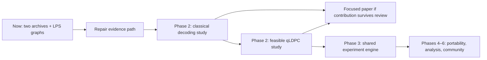

# Q1729 — Vision & Roadmap

q1729 aims to become a reproducible computational research platform built around
Ramanujan mathematics, accelerated classical computation and quantum simulation.
Today it has two archived local GPU runs and an initial graph construction.
The platform is the destination, earned through validated experiments and reuse.

The [README](../README.md) defines the three-stage research thread: π;
community/publication; Ramanujan graphs → qLDPC. This document defines execution
order: Stage 1 maps to Phase 1, Stage 3 to Phase 2, and Stage 2 is a continuing
workstream. [ADR 007](adr/007-evidence-first-phase-gates.md) records this revision.

## Where the repo actually is (v0.3.0)

Audit date: **2026-09-23**, release baseline `8005352`. This checkout has two
measured RTX 5070 Laptop GPU archives, including a run under the committed
protocol, and a reviewed findings record. The GPU suite was re-verified on
2026-09-23 in WSL2 on Python 3.14.7 with CUDA-Q 0.16.0.post1 and CuPy 14.2.0:
386 passed, 1 skipped, 100% coverage. Python 3.14 is now the only supported
interpreter on every host.

- Phase 0 standards are adopted and semantic run-file validation exists.
  Enforcement is incomplete: a protocol digest proves internal consistency,
  not that its operator followed the declared procedure.
- Phase 1 delivered a hand-written CUDA C++ kernel, known-amplitude QAE
  circuit, harness, figures and two RTX archives. P1-R1 through P1-R4 were
  completed for v0.3.0. A later audit found additional evidence defects.
  Late failures discarding completed work and the unenforced time budget were
  repaired on 2026-09-23 (schema 5, protocol version 2, ADR 011). Still open:
  the review record hashes only one source in a two-run comparison, and
  derived QAE fields are not validated. These must be repaired before a
  stronger reproducibility claim. No H100
  result exists.
- QAE encodes the already-known amplitude `math.pi / 4`. This is a simulator
  case study, not an independent π algorithm or quantum-advantage result.
  No crossing was observed within the tested sweep.
- Phase 2 has exact modular LPS graph construction and floating-point spectral
  checks, not an exact spectral proof. No parity-check implementation, decoder
  or qLDPC experiment exists.
- This session's Windows no-key suite passed 358 tests, skipped 29 and covered
  1282/1285 statements (99.77%). The three uncovered statements are in the
  real CUDA-Q diagnostic. CI CPU simulation and GPU integration remain
  separate evidence.
- NIM drafts unchecked prose from JSON. Its output needs human review; raw
  measured JSON is never corrected by rewriting its numbers.

The next work is the Phase 2 question/protocol (P2-A), alongside repairs to
the evidence path above.

## Sequence at a glance

| Phase | Deliverable | Status |
| --- | --- | --- |
| 0 — constitution | Evidence standards and decision records | Adopted; enforcement gaps remain |
| 1 — first real result | Scoped π simulator case study | Two archives delivered; additional evidence defects open |
| 2 — second experiment | Classical decoding controls, then feasible qLDPC | Graph construction only |
| 3 — shared engine | Reuse extracted from two validated experiments | Deferred until repeated needs exist |
| 4 — backend independence | Controlled portability study; ROCm per ADR 006 | Conditional; no verified port or AMD run |
| 5 — longitudinal analysis | Reusable cross-run analysis tools | Deferred tooling; statistics required now |
| 6 — research community | Independent reproduction and maintenance | Participation welcome; platform maturity unearned |

Every gate closes with linked evidence, not a date or an implementation checkbox.
Independent design work can overlap; later phases cannot waive earlier gates.

## Phase 0 — Constitution (lightweight)

Keep the [principles](handbook/principles.md) and
[research standards](handbook/research-standards.md) as requirements. Distinguish
a rule, its implementation and evidence that it was exercised. Preserve session
history and ADR bodies; add dated amendments. Commit prospective protocols
before new runs. A hypothesis constant first committed with its result does not
prove preregistration; the existing archive remains useful exploratory evidence.

## Phase 1 — The first real result

**Immediate milestone: repair the evidence path and produce one bounded repeat.**
Preserve the old archive and read its
[reviewed interpretation](../benchmarks/runs/2026-08-05-rtx5070-turbo-reviewed.md).

### P1-R1 — Protect and validate evidence

- [x] Refuse to overwrite measured JSON; preserve figures under run-specific paths.
- [x] Introduce versioned semantic validation: nonempty required values, types,
  finite numbers, repeat counts, backend identity and measured/synthetic status.
- [x] Apply validation at writer, plotter, narrator and CI boundaries, with
  explicit legacy handling and meaningful malformed-input/overwrite tests.

**Exit:** conflicting outputs and invalid records are rejected without altering
archives; valid old data stays readable under its legacy schema.

**Implementation verified on CPU, 2026-09-06:** shared validation and exclusive
outputs pass boundary tests; new validator/archive modules have 100% statement
coverage. Schema and legacy behavior are in [run-file.md](run-file.md) and ADR 008.
Fresh Linux/CI full-gate verification remains unavailable; WSL2 cannot attach
its disk. Do not treat local completion as release readiness.

### P1-R2 — Make each claim traceable

- [x] Capture source revision/dirty state, resolved dependencies, selected device,
  actual simulator target/precision and complete experiment configuration.
- [x] Retain each repeat's outcome, timing and QAE counts; record supported seeds
  and any backend nondeterminism. Schema 3 retains every timed outcome.
- [x] Derive plot/control labels from actual backend metadata, including CPU fallback.
- [x] Require review of every numerical and causal statement in NIM findings.
- [x] Resolve non-kernel coverage exclusions; make release checks verify quality
  results, version/changelog agreement and main ancestry.

**Exit:** every plotted point is traceable to samples, configuration and source.
The 100% CI coverage gate stays unchanged. Release automation already exists;
it now depends on preflight checks and a fresh reusable CI run for the tag.

**Implementation verified on CPU, 2026-09-06:** 316 passed, 29 skipped;
new/changed modules have 100% statement coverage. Overall Windows coverage is
99.73% because the real CUDA-Q backend diagnostic is unavailable. No real GPU
run or seeded reproduction was performed. See [ADR 009](adr/009-traceable-outcomes-and-reviewed-releases.md)
and [findings review](findings-review.md). Runtime verification stays open.

### P1-R3 — Define and verify the measurement

- [x] Commit a bounded protocol: sweep, repeats/shots, uncertainty, exclusions
  and stopping rule before collecting new data.
- [x] Separate wrapper construction, allocation, transfer and device execution
  when attributing costs. Warmup does not remove all wrapper work.
- [x] Profile representative cases before asserting a dispatch/arithmetic bottleneck.
- [x] Explain QAE quantization analytically and check sample distributions;
  distinguish relative/absolute error and floating-point reference limits.
- [x] Re-establish Linux/WSL2 runtime availability and run real-backend tests;
  report Windows, CPU simulator CI and GPU evidence separately.

**Exit:** declared timing boundaries and uncertainty, supported causal claims or
explicit hypotheses, and fresh relevant integration evidence. **Met 2026-09-06**
— runtime restoration was separate machine maintenance and has now been done.

**Implementation verified on CPU, 2026-09-06:** 316 passed, 29 skipped; 1130
statements, 3 missed, 99.73%. Every module reaches 100% except the CUDA-Q
backend diagnostic, which needs cudaq. The protocol is committed in
`benchmarks/protocol.py` and hashed into schema-4 run files
([measurement-protocol.md](measurement-protocol.md), [ADR 010](adr/010-committed-measurement-protocol.md));
`classical.cuda_kernel.time_phases` separates handle/allocate/execute/transfer/
reduce with CUDA events, leaving `partial_sum` unchanged for archive
comparability; `quantum/quantization.py` derives the plateau as the finite
range **m = 10..17** and reproduces all 15 archived QAE outcomes to 1e-12, 8 of
them on the conjugate peak.

**Runtime restored and profiled, 2026-09-06.** WSL2's virtual disk was found
deleted, not detached; the distro was rebuilt as Ubuntu 26.04 with a uv-managed
Python 3.13.15 venv (CUDA-Q 0.15.1 had no cp314 wheel at that time). On the
restored host the initial full suite was **344 passed, 1 skipped, 100.00%
coverage**. The v0.3.0 release later recorded 347 passed, 1 skipped and 100%
coverage. The single skip was the live NIM test.

**Profiling result (reproduced twice, 7 repeats each).** Phase attribution on
the classical arm, milliseconds:

| n_terms | end-to-end | kernel_handle | execute (device) | share that is device |
| ---: | ---: | ---: | ---: | ---: |
| 2 | 4.05 | 3.08 | 0.030 | ~1% |
| 64 | 3.58 | 3.09 | 0.087 | ~2% |
| 1024 | 6.53 | 3.39 | 2.50 | ~38% |
| 16384 | 69.96 | 3.62 | 65.85 | ~94% |

`kernel_handle` is per-call `RawModule` construction and is roughly constant
in this diagnostic; device `execute` scales with n. The diagnostic's two-term
handle share was 3.08/4.05 ms, about 76%. It used a different timing path and
an unrecorded power profile, so it cannot apportion the archived 2.714 ms
two-term timing. The archived figure remains an end-to-end wall time.

This licenses a *wrapper*-overhead statement, which is measured. It still does
not license a per-gate dispatch claim about the **quantum** arm, which has not
been profiled. Profiling ran at an unrecorded power profile and wrote no
archive; the archived run under a declared profile is P1-R4.

### P1-R4 — Repeat and review

- [x] Execute the predeclared local protocol into a new unique archive.
- [x] Generate run-specific figures and human-reviewed findings.
- [x] Explain disagreements with the old archive without selecting favorable runs.
- [x] Demonstrate reproduction from documented setup and resolved dependencies.

**First run under the committed protocol, 2026-09-06.** Archived as
`benchmarks/runs/2026-09-06-1286200412954fb4a59cac02c27a06df.json`
(schema 4, protocol digest `24d1d3af702a`, source `15c0da6` **clean**, target
`nvidia`/fp32, driver 616.56, power profile `turbo`, shots 4000, 5 repeats,
27 rows, 2m18s). Figures in `benchmarks/plots/2026-09-06-1286200412954fb4a59cac02c27a06df/`.
The 2026-08-05 archive is untouched and both now validate side by side.

**Comparison with the 2026-08-05 archive** (same profile, same shots, so this
is like-for-like; driver moved 610.88 to 616.56):

- **Classical arm reproduces within ±12%** across all 12 term counts
  (ratios 0.88-1.10), and the large-n points agree closely: 16384 terms went
  68.997 ms to 67.584 ms. Double-precision saturation is unchanged at 16.00
  correct digits.
- **QAE timing shifted systematically with m**: small registers are ~25%
  faster (m=2 ratio 0.72) and the two largest are ~7-10% slower (m=15 ratio
  1.10, m=16 ratio 1.07). The crossing sits near m=14. Small-m cost is
  dominated by fixed per-call overhead and large-m by statevector work, so a
  driver change plausibly moves those in opposite directions — but this run
  did not isolate that, and thermal drift over a 2m18s sweep is not excluded.
  **Recorded as an observation, not an explanation.**
- **Every QAE outcome is unchanged.** All 15 rows reproduce the archive's pi
  estimate to 1e-12 and agree with closed-form theory; each row's sampled
  distribution sits below its own sampling tolerance. Quantization is
  deterministic, so this is the expected result — and it is what makes the
  timing comparison meaningful, because the two runs computed the same thing.
- Best accuracy is unchanged: classical 16.00 correct digits, QAE 5.00.

No result was selected across runs; this is the first run collected under the
protocol and it is archived whatever it showed.

**Findings reviewed and approved 2026-09-06** by Arjun Ganesh, recorded in
`benchmarks/runs/2026-09-06-1286200412954fb4a59cac02c27a06df-findings.review.json`
over all 18 paragraphs. The draft was revised before review so that it cites
only the two archived run files: the process paragraph now states the recorded
stopping and exclusion rules and says plainly that a file cannot prove they were
followed, the end-to-end caveat cites this file's own
`configuration.phase_attribution` instead of an out-of-archive diagnostic, and
the timing reversal offers no explanation at all. 39 machine checks over the
draft's numeric claims pass with no mismatch.

**P1-R4 was completed for v0.3.0.** Additional evidence defects identified
after release are listed in the current-state section above.

**Exit:** a new auditable run and reproducible analysis including limitations.
H100 is optional: proceed only with a specific question, a working runtime,
validated archives and an explicit resource budget.

## Phase 2 — The second experiment

Prospective question family: how do explicit LPS-derived sparse codes behave
under controlled decoding, and where does GPU acceleration help at matched
accuracy? Novelty is not yet established.

### P2-A — Choose the question and construction

- [ ] Build a literature/contribution table for graph-derived LDPC codes,
  hypergraph-product codes and existing CPU/GPU decoders.
- [ ] Commit a one-page protocol: code sizes, noise, decoder, baselines, metrics,
  statistics, stopping rule, memory/runtime budget and contribution candidate.

**Exit:** a feasible falsifiable question useful even if acceleration loses.
If novelty or feasibility fails, revise the question before implementation.

### P2-B — Classical code and reference decoder

- [ ] Specify the graph-to-parity-check mapping and implement sparse matrices.
- [ ] Calculate exact GF(2) rank/dimension and justified distance bounds.
- [ ] Implement a CPU decoder with independent exhaustive tiny-case controls.

**Exit:** validated classical code parameters and decoder behavior. This is
classical LDPC work, not yet qLDPC or quantum error correction.

### P2-C — Controlled classical decoding study

- [ ] Compare CPU/GPU with identical code/noise instances and matched accuracy
  and stopping criteria; include small workloads where CPU may win.
- [ ] Record failure rates with uncertainty, throughput, latency, memory and
  transfer/batching costs. Archive protocol, outcomes and reproducible analysis.

**Exit:** a defensible classical study, potentially enough for a focused paper.
It does not by itself complete Phase 2.

### P2-D — Feasible quantum construction and decoding

- [ ] Validate a tiny known CSS control, including `Hx * Hz.T = 0` over GF(2).
- [ ] Choose a budgeted LPS-derived qLDPC construction; verify parameters,
  commutation, sparse representation and the decoder interface.
- [ ] Run a specified quantum-code noise/decoding study with controls and
  uncertainty, then archive reviewed findings and reproduction instructions.

The audit's exploratory 1092×1092 bipartite parity-check matrix has GF(2)
rank 794 and dimension 298. Its self hypergraph product would have **2,384,928
physical qubits**; one dense uint8 stabilizer matrix would need about 2.84 TB.
These are parameter calculations, not an implemented or decoded quantum code.
Sparse decoding can avoid a statevector but still needs a memory/runtime budget.

**Phase 2 exit:** a validated quantum-code experiment, beyond graph construction,
classical decoding or an unrelated tiny CSS demonstration.

### Publication and arXiv gate

A paper can precede the platform. Start with a focused technical report; pursue
a preprint when evidence supports a contribution beyond reproducing known facts.

- [ ] Related work and a precise contribution statement.
- [ ] Correct mathematics, fair baselines and declared statistical analysis.
- [ ] Archived code/data/configuration and independent reproduction or documented
  reproduction feedback, including limitations and negative findings.
- [ ] Complete manuscript reviewed by someone able to challenge the method.
- [ ] Human authorship responsibility, appropriate AI-use disclosure, and current
  category/endorsement/submission requirements checked at submission time.

A controlled graph-derived decoding study is the provisional candidate; novelty
remains unverified. An expanded simulator study is possible if related work
supports a substantive contribution. arXiv is moderated and is not peer review;
endorsement and acceptance are not guaranteed. See the official
[moderation policy](https://info.arxiv.org/help/moderation/index.html) and
[endorsement requirements](https://info.arxiv.org/help/endorsement.html).

## Phase 3 — Shared experiment engine

Extract repeated configuration, provenance, persistence, validation and analysis
needs from two validated experiments. Keep experiment-specific logic separate.
Do not precommit to package trees, plugins or multiple storage formats.
**Exit:** both studies reproduce through shared code with less duplication and
no weakened scientific contract.

## Phase 4 — Backend independence

ROCm remains designated by [ADR 006](adr/006-rocm-as-phase-4-second-backend.md).
Establish same-vendor reproduction as that ADR requires, then budget a real
portability study. Source compatibility is not a verified port. Never interpret
an AMD GPU classical path versus CPU quantum fallback as a GPU crossover.
A second simulator requires its own ADR and same-device control.
**Exit:** a real portability result with confounds stated.

## Phase 5 — Longitudinal analysis

Build reusable cross-run uncertainty/regression tools when archives demonstrate
recurring needs. Statistical design and uncertainty are required in Phase 1
and every subsequent study. **Exit:** compatible runs can be compared without
silently pooling different protocols.

## Phase 6 — Research community

Prioritize independent reproduction, usable contribution guidance and maintainable
releases. Add a site, governance roles or plugins when researchers need them.
**Exit:** others can reproduce and extend a study without private guidance.

## Research standards

The [nine-field contract](handbook/research-standards.md) applies throughout.
Close gates with dated, host-specific source/data/check evidence.

## Repository target layout

Keep the current layout until Phase 3 demonstrates useful shared abstractions.

## Definition of success

First earn a reproducible finding, then a possible paper and reusable research
tools. Platform maturity requires repeated experiments and independent use.
No phase requires a predetermined positive result.

## GitHub strategy

Use small reviewable changes, preserve archives and release verified main commits.
Editing a checklist does not establish completion or authorize publication.

## Roadmap governance

Material sequencing/architecture changes get an ADR. Update gates when evidence
changes feasibility; avoid speculative dates. P1-R1 through P1-R4 produced
the v0.3.0 release and historical real-hardware evidence. The next research
work is **Phase 2**, starting at P2-A, alongside the evidence repairs in the
current-state section.

## Anti-roadmap

No speculative platform scaffold, unsupported quantum advantage, automatic trust
in AI prose, cloud rental without a question, promised paper acceptance, or
statistics deferred until the end. Reassess when novelty or resource gates fail.
